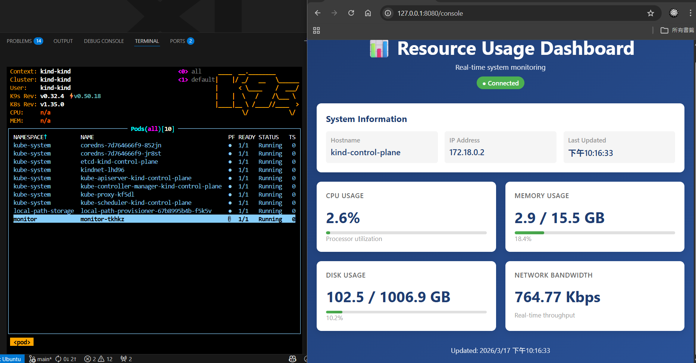

# What's this repo
A simple node resource monitor provides cpu, memory, bandwidth, gpu information.

# APIs
1. `/console GET` provides UI (gen by copilot)
2. `/resources GET` provides information of the node where monitor is (websocket)

# How to test?
1. `make dev`
2. `kubectl port-forward svc/monitor 8080:8080 -n monitor` or `k9s`
3. visit `localhost:8080/console`
